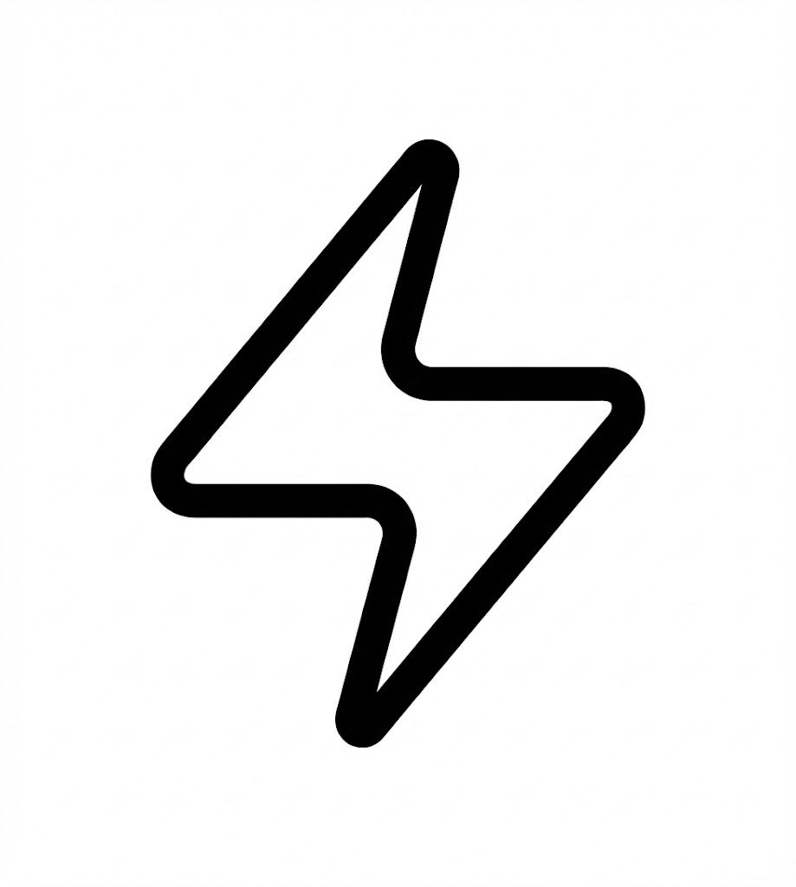

# PasteClean

Hi everyone!

This is **PasteClean**, a simple tool I made to help keep your shared links clean and private. It automatically removes those annoying tracking parameters (like `?utm_source=...`) from URLs when you copy them.

## What it does

- **Clean Links**: Strips out tracking IDs, referral codes, and other junk from URLs.
- **Automatic**: Just copy a link as usual, and PasteClean handles the rest.
- **Privacy Focused**: Stop sharing your browsing history with every link you send.

## How to use

1. Download the latest installer from [Releases](../../releases).
2. Install and run.
3. Copy a link with tracking garbage.
4. Paste a clean link. Simple.

## Support Me

If you like the app and want to support my work, you can buy me a coffee!

## Contributing

Feel free to open an issue or PR if you have ideas!

## License

MIT License.
