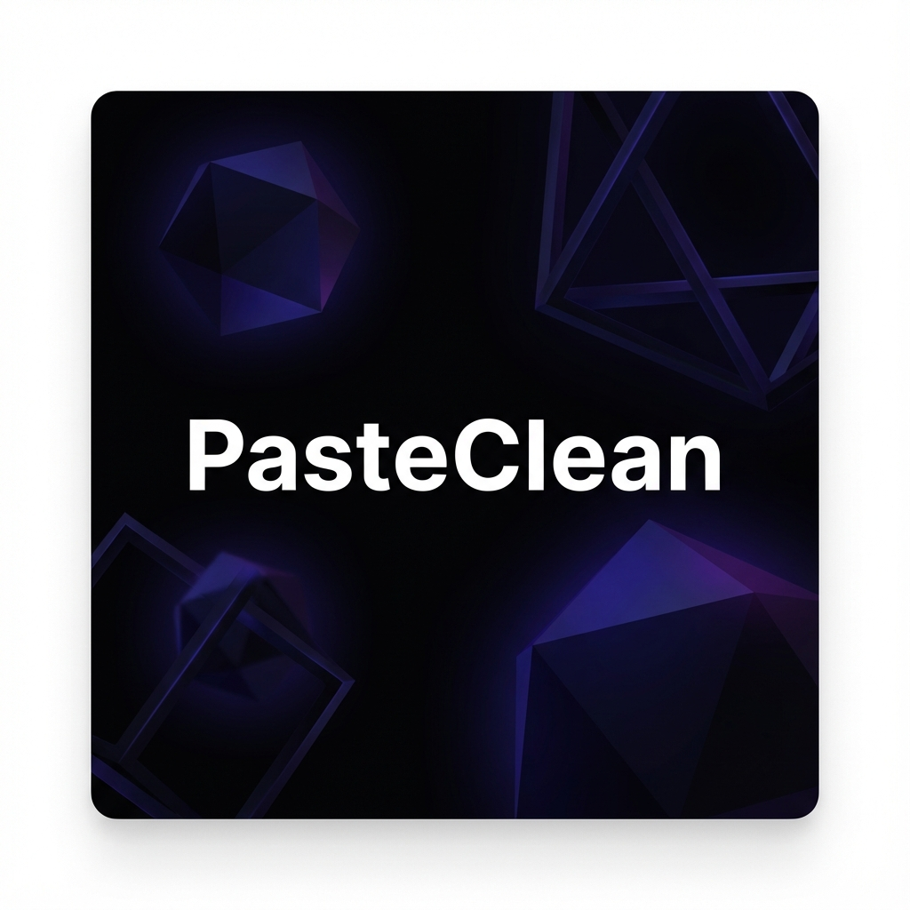

<div align="center">

  

  # PasteClean
  
  **Sanitize your links. Reclaim your privacy.**
  
  [](https://opensource.org/licenses/MIT)
  [](https://github.com/iiXotic/PasteClean)
  [](https://github.com/iiXotic/PasteClean/releases)

  <p align="center">
    <a href="#-features">Features</a> •
    <a href="#-download">Download</a> •
    <a href="#-pro-features">Pro Version</a> •
    <a href="#-development">Development</a>
  </p>
</div>

---

## 🚀 What is PasteClean?

**PasteClean** is a privacy-focused tool that automatically strips tracking parameters (like `?utm_source=`, `fbclid=`, `si=`) from URLs. It runs locally on your machine, ensuring your data never leaves your clipboard.

Stop sharing your browsing history with marketers. Clean your links before you share them.

## ✨ Features

- **🛡️ Privacy First:** Removes 50+ common tracking parameters automatically.
- **📋 Auto-Clean Clipboard:** (Optional) Monitors your clipboard and cleans links instantly as you copy them.
- **⌨️ Global Hotkey:** Press a custom shortcut to clean the link currently in your clipboard from *any* app.
- **🌑 Dark Mode:** Sleek, modern interface that respects your system theme.
- **⚡ Lightning Fast:** Native performance powered by Electron and React.

## 💎 Pro Features
*Support independent development and unlock power-user tools:*

- **🔗 Link Unshortener:** Reveal the true destination of `bit.ly` or `t.co` links and strip their hidden trackers.
- **📦 Batch Mode:** Clean lists of URLs or entire paragraphs of text in milliseconds.
- **📊 Privacy Stats:** Visualize how many trackers you've blocked and time saved.

[**Get Pro Lifetime License**](https://iamxotic.gumroad.com/l/Pasteclean)

## 📥 Download

Download the latest version for Windows:

[**Download PasteClean v0.2.1**](https://github.com/iiXotic/PasteClean/releases)

## 🛠️ Development

Built with **Electron**, **React**, **TypeScript**, and **Tailwind CSS**.

```bash
# Clone the repository
git clone https://github.com/iiXotic/PasteClean.git

# Install dependencies
npm install

# Start development server
npm run electron:dev

# Build for production
npm run electron:build
```

## 📄 License

This project is open source and available under the [MIT License](LICENSE).

---
<div align="center">
  <sub>Built with ❤️ by <a href="https://github.com/iiXotic">iiXotic</a></sub>
</div>
